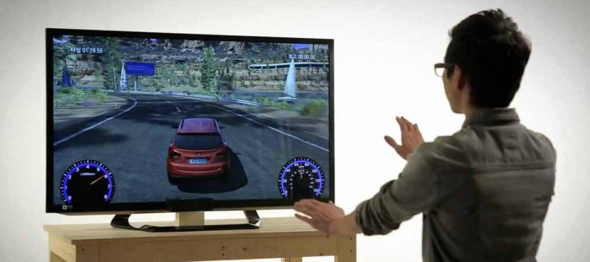

# Gesture Recognition for Smart TV Control

## Project Overview
This project addresses the challenge of creating an intelligent gesture recognition system for smart TVs, enabling users to control their devices without a remote. By utilizing a webcam, the system identifies five specific gestures—thumbs up, thumbs down, left swipe, right swipe, and stop—each mapped to commands like volume control, playback navigation, and pausing. The solution processes video sequences of 30 frames and employs cutting-edge deep learning techniques to achieve robust spatiotemporal modeling and high accuracy.

## Problem Statement
The primary objective was to design a system that accurately recognizes gestures captured through a webcam and maps them to TV commands:
- **Thumbs Up**: Increase volume
- **Thumbs Down**: Decrease volume
- **Left Swipe**: Jump backward 10 seconds
- **Right Swipe**: Jump forward 10 seconds
- **Stop**: Pause playback

The challenge involved extracting spatial and temporal features from videos to generalize effectively across unseen data, ensuring the system's reliability in real-world scenarios.

## Key Technologies and Architectures
### Technologies:
- **Conv3D**: Spatiotemporal modeling through 3D convolutions, processing entire video sequences directly.
- **CNN + RNN**: Sequential architecture combining CNN for spatial feature extraction and RNN (GRU, LSTM) for temporal modeling.
- **Transfer Learning**: Leveraged pre-trained MobileNet for efficient spatial feature extraction.
- **Regularization**: Dropout layers and learning rate scheduling to prevent overfitting.
- **Data Augmentation**: Generated diverse training samples to enhance generalization.

### Architectures Explored:
1. **Conv3D**:
   - Processed videos as 3D tensors, capturing both spatial and temporal information.
   - Variants included different filter sizes, resolutions, and regularization techniques.
2. **CNN + LSTM**:
   - Utilized CNN for frame-level feature extraction, followed by LSTM to model sequential dependencies.
3. **CNN + GRU**:
   - Similar to the CNN-LSTM approach, but with GRU for reduced computational complexity and effective temporal modeling.
4. **Transfer Learning + GRU**:
   - Incorporated pre-trained MobileNet for spatial features, with GRU capturing temporal dependencies.
   - Emerged as the best-performing architecture with a validation accuracy of 84%.

## Performance Comparison

| **Model** | **Architecture**       | **Validation Accuracy** | **Comments**                                                                 |
|-----------|-------------------------|--------------------------|-------------------------------------------------------------------------------|
| **9**     | Conv3D + Augmentation  | 71%                     | Strong performance with regularization and data augmentation.                |
| **15**    | Conv3D (Optimized)     | 81%                     | Balanced accuracy and parameter efficiency.                                  |
| **18**    | Transfer Learning + GRU| 84%                     | Best performance. Leveraged MobileNet and GRU for robust generalization.     |

## Conclusion
Model 18, combining Transfer Learning and GRU, was finalized as the most robust architecture, achieving a validation accuracy of 84%. It demonstrated:
- **Efficient Spatial-Temporal Modeling**: Transfer learning with MobileNet enabled high-quality spatial feature extraction.
- **Optimal Temporal Dynamics**: GRU captured temporal dependencies effectively with fewer parameters than LSTM.
- **Generalization and Scalability**: Regularization techniques and data augmentation enhanced performance across unseen data.

This project exemplifies the integration of advanced deep learning techniques with real-world applications, showcasing the importance of architecture optimization in solving complex video classification tasks.

---

**Author**: Ursina Sanderink  
**Acknowledgements**: This project was developed as part of the **Postgraduate Program in Machine Learning and Artificial Intelligence by IIIT-Bangalore**.
